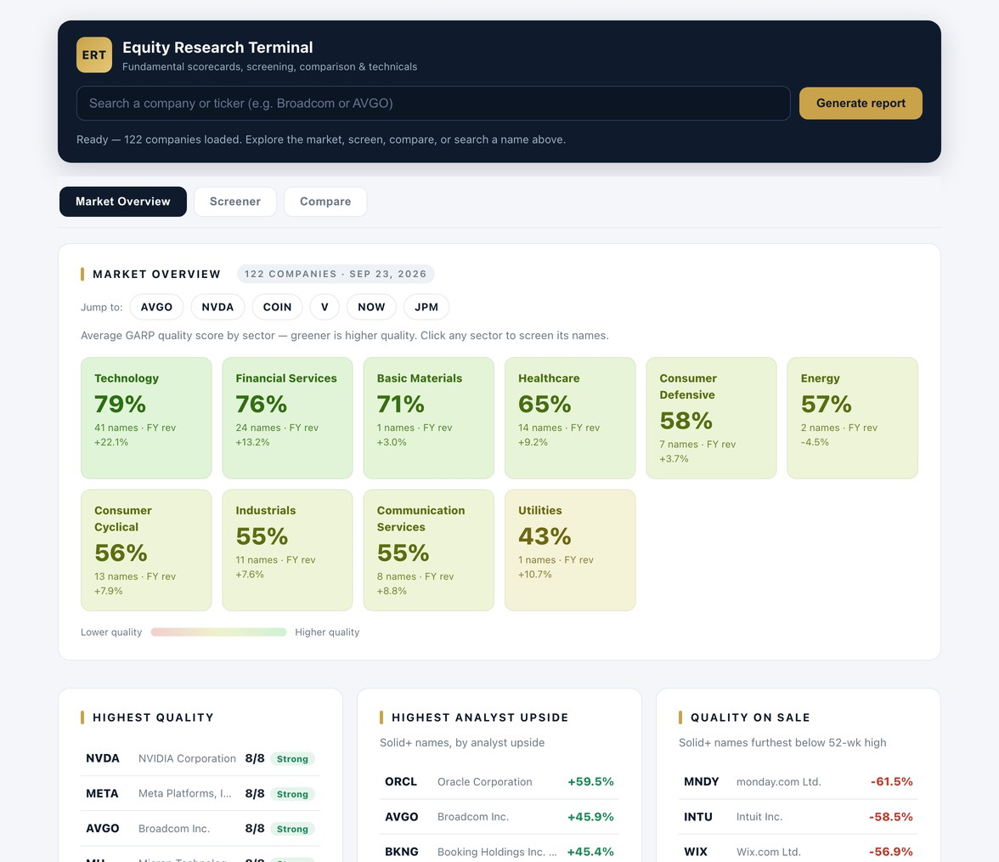
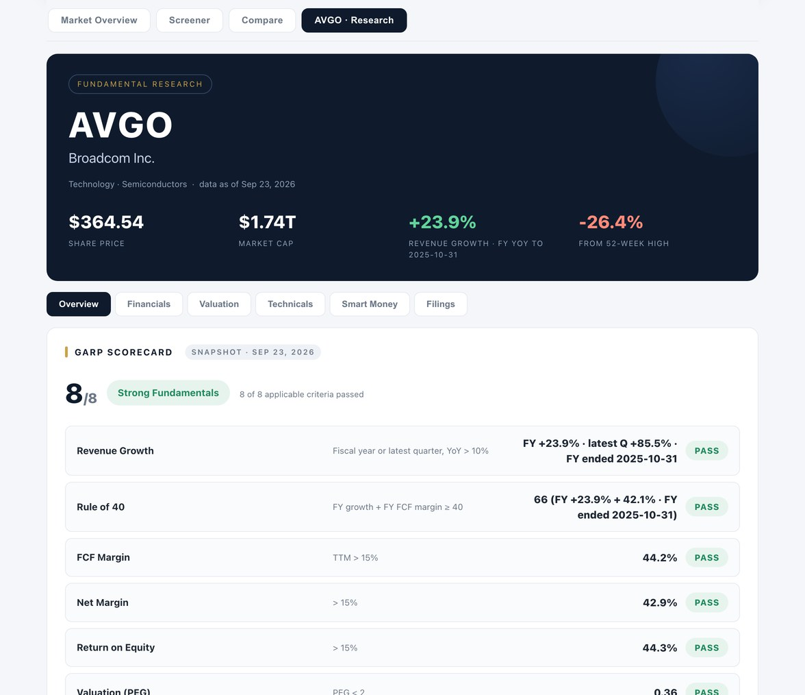

# Equity Research Terminal

Built by **Bar Barzilay** — [LinkedIn](https://www.linkedin.com/in/bar-barzilay-ba932235b) · [GitHub](https://github.com/barbarzilay100-coder) · [barbarzilay100@gmail.com](mailto:barbarzilay100@gmail.com)

A live, single-page **equity research terminal** covering the US large-cap universe defined in `pipeline/build_data.py` — mega-cap tech, financials, healthcare, consumer, industrials and Israeli dual-listed names (TEVA, NICE, CHKP, WIX, MNDY, CYBR, ESLT). The live coverage count is shown in the site footer. Four modes, plus a Deal Radar board:

- **Market Overview** — a GARP-quality heatmap by sector plus leaderboards (Highest Quality, Highest Analyst Upside, Quality on Sale).
- **Screener & Leaderboard** — sort and filter the whole universe by any metric or GARP score.
- **Compare** — put 2–3 companies side by side, best value per row highlighted.
- **Research** — type any company or ticker for a full report, organized into sub-tabs: a graded GARP
  scorecard + investment memo, financials — including an **as-reported reconciliation**, each
  figure set beside the same line as filed with the SEC and linked to the filing — valuation
  & analyst targets, including a sector-relative
  implied value computed in the pipeline from peer-median EV/EBITDA and forward P/E — a technicals tab (50/200-day
  moving averages + RSI signals), a **Smart Money** tab (institutional ownership, 13F position
  changes, and insider buying/selling), and a **Filings** tab — six months of SEC filings per company,
  classified from EDGAR form types and 8-K item codes.
- **Deal Radar** — a Market Overview board of M&A completions, merger-related filings (S-4/425/tender offers)
  and new activist / >5% stakes (13D/G) across the whole universe, sourced from SEC EDGAR and classified
  deterministically — no text parsing, no AI.

**Live demo:** https://barbarzilay100-coder.github.io/equity-research-terminal/





## Skills demonstrated

| Feature | Skill it proves |
|---|---|
| `pipeline/build_data.py` / `pipeline/build_prices.py` / `pipeline/build_flow.py` — yfinance data pipelines | Python, data acquisition & cleaning |
| `pipeline/build_events.py` — SEC EDGAR filings pipeline; Deal Radar built from 8-K item codes, S-4/425, 13D/G | M&A awareness, working with primary sources |
| `pipeline/build_sec.py` — as-filed figures from the SEC XBRL Company Facts API, shown against the vendor's | Reconciliation against a primary source |
| Deterministic GARP scorecard — 8 pass/fail criteria per company | Financial statement analysis |
| Sector-relative implied valuation — peer-median EV/EBITDA & forward P/E repricing | Relative valuation (comps) |
| CI-gated e2e test + [data validation](docs/validation-report.md) — reconciliation & bounds checks gate every refresh | Accuracy, reconciliation & attention to detail |
| Sector heatmap, screener, leaderboards, side-by-side compare | BI dashboards & data visualization |
| [Excel valuation workbook](docs/valuation-models.xlsx) — 5-yr DCF + trading comps, named ranges, sensitivity table | Advanced Excel & financial modeling |
| SQLite snapshot (`terminal.db`) + [windowed analytical queries](sql/queries.sql) | SQL |

## How it works

The app is fully static (hosts on GitHub Pages), yet always current, thanks to a three-part design:

1. **`pipeline/build_data.py`** — a Python pipeline that pulls fundamentals for a universe of major US companies
   via `yfinance`, computes every metric, and writes **`data.js`** (and `data.json`). No API key required.
2. **`pipeline/build_prices.py`** — enriches each company with a compact `tech` block: a one-year weekly price
   series, 50- and 200-day moving averages, and a 14-day RSI (used for the price chart and signals).
3. **`pipeline/build_flow.py`** — adds a `flow` block of "smart money" signals: institutional ownership,
   quarter-over-quarter 13F position changes, and insider (Form 4) buying/selling.
4. **`pipeline/build_events.py`** — adds an `events` block from the free **SEC EDGAR** submissions API:
   every recent filing classified deterministically by form type and 8-K item code (M&A completions,
   merger filings, activist stakes, leadership changes, results), powering the Deal Radar board and
   the per-company Filings tab.
5. **`pipeline/build_sec.py`** — adds a `sec` block of as-reported figures: revenue, net income,
   free cash flow and shareholders' equity for the latest annual filing, taken from the **SEC XBRL
   Company Facts** API with the accession number and the XBRL tag behind every number, so the
   Financials tab can set the vendor's figures against the company's own.
6. **GitHub Actions** (`.github/workflows/update-data.yml`) — runs all five pipelines automatically every
   weekday morning and commits the refreshed `data.json`/`data.js`, so the site never goes stale.
7. **`index.html`** — a zero-dependency front end that loads `data.js` and renders every view,
   including a deterministic **GARP scorecard** (pass/fail against defined thresholds).

Because the numbers are pre-computed and committed, the site loads instantly, works offline, exposes
no secrets, and never hits an API rate limit during a demo.

## The GARP scorecard

Each company is scored on eight quality-and-value criteria: revenue growth, Rule of 40, FCF margin,
net margin, return on equity, PEG, forward multiple discount (forward vs. trailing P/E), and balance-sheet
leverage. Criteria that don't fit a sector's business model are excluded per company rather than counted
as failures — Rule of 40 applies only to growth sectors, and FCF margin / debt-to-equity are skipped for
Financial Services — so each score is shown out of its applicable count. The verdict band is derived
from the pass rate.

Every threshold, its source, and the model's limitations are documented in
[docs/METHODOLOGY.md](docs/METHODOLOGY.md).

## Excel valuation models

A companion workbook, [docs/valuation-models.xlsx](docs/valuation-models.xlsx) — generated by
`pipeline/build_excel.py` from the same data snapshot — contains a 5-year FCF DCF for Microsoft with
named-range assumptions and a WACC × terminal-growth sensitivity table, plus a semiconductor
trading-comps sheet that reprices Broadcom at peer-median multiples. All model math lives in
live Excel formulas: change a lever and the workbook recalculates.

## SQL layer

The pipeline also writes **`terminal.db`** (via `pipeline/build_db.py`) — a SQLite snapshot of the
universe, refreshed with every data run — so everything the site shows is queryable with
plain SQL. Besides the scalar `companies` table it carries an `events` table of classified SEC
filings. [sql/queries.sql](sql/queries.sql) holds six analytical queries; for example,
top-quartile ROE within each sector via a window function:

```sql
SELECT sector, ticker, roe
FROM (SELECT sector, ticker, roe,
             NTILE(4) OVER (PARTITION BY sector ORDER BY roe DESC) AS quartile
      FROM companies WHERE roe IS NOT NULL)
WHERE quartile = 1
ORDER BY sector, roe DESC;
```

The others: sector growth/profitability profiles, a double-confirmation screen (names where
both the sector-relative implied valuation and analyst consensus see >10% upside), best
FCF-margin names per sector with `RANK()`, a PEG × ROE value-vs-quality quadrant
aggregation, and a Deal Radar screen joining recent M&A / activist filings back to each
company's valuation. Run them with `sqlite3 terminal.db < sql/queries.sql`.

## Optional AI layer

The Investment Memo is auto-generated from the data and scorecard. Paste an Anthropic API key on the
report to upgrade it to a full analyst thesis written by Claude — the numbers stay the deterministic core.

## Run locally / refresh manually

```bash
pip install -r requirements.txt
python pipeline/build_data.py                 # fundamentals -> data.js (+ data.json)
python pipeline/build_prices.py fetch 0 200   # price history + technicals for the universe
python pipeline/build_prices.py merge         # fold tech into data.js / data.json
python pipeline/build_flow.py fetch 0 200     # smart money: ownership + insider flow
python pipeline/build_flow.py merge           # fold flow into data.js / data.json
python pipeline/build_sec.py fetch 0 200      # as-reported figures from SEC XBRL
python pipeline/build_sec.py merge           # fold sec into data.js / data.json
python pipeline/build_db.py                   # data.json -> terminal.db
python pipeline/validate_data.py              # reconciliation + bounds report
```

Then just **double-click `index.html`** — it loads `data.js` via a script tag, so it works
directly from the file system (no local server needed) and on GitHub Pages alike.

To expand coverage, edit the `UNIVERSE` list in `pipeline/build_data.py`.

## Tests

An end-to-end smoke test boots the whole app in jsdom and exercises all four views,
the report sub-tabs, filtering, comparison and search:

```bash
npm install jsdom
node tests/e2e.cjs
```

The CI workflow runs it after every data refresh — if the data or the app breaks,
nothing gets committed.

A separate validation step (`pipeline/validate_data.py`) reconciles every derivable field against its
inputs (analyst upside, implied upside, EV/FCF, margins vs. reported revenue), bounds-checks
the rest, and hard-fails the workflow on anomalies. Each run's findings are committed as
[docs/validation-report.md](docs/validation-report.md).

## Stack

Python · yfinance · GitHub Actions · vanilla JS · Chart.js · Anthropic API
